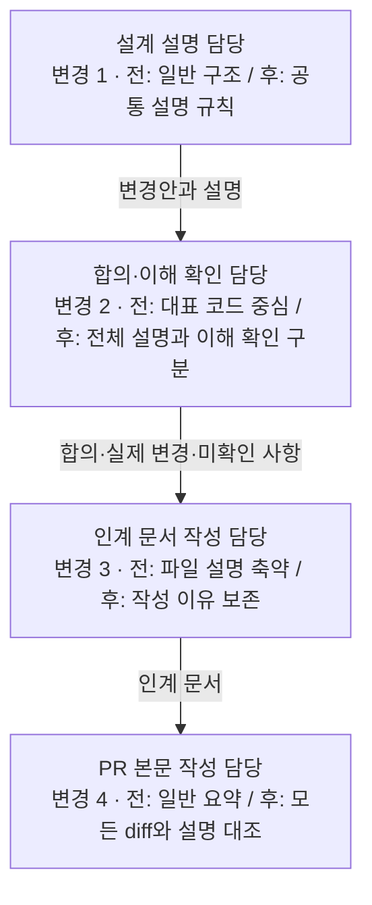
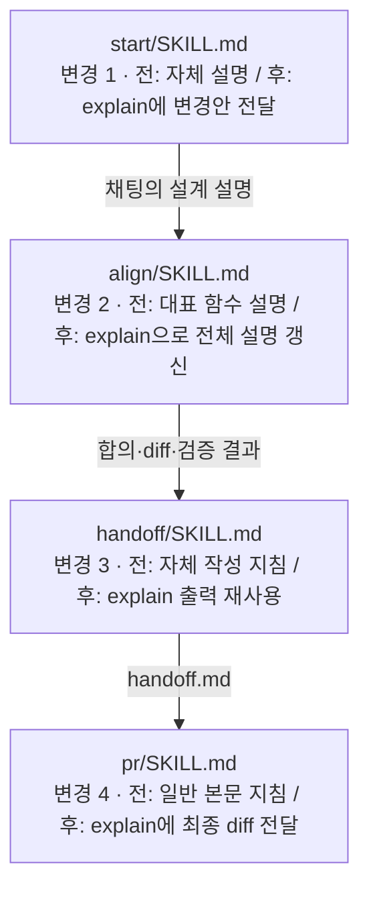

# explain을 모든 diff의 작성 이유를 설명하는 공통 스킬로 만든다

## 배경

여러 모듈을 수정한 PR에서 파일 목록과 구조 그림을 제공해도, 독자가 데이터의 이동과 각 파일의
책임을 연결하기 어려웠다. Reflica의 messages.jsonl 개선 설명에서는 인프라·처리 주체·로직이
같은 상자로 표현되고, 화살표에도 호출과 데이터 전달이 섞였다. 하이레벨과 파일레벨의 배치까지
달라져 같은 경로를 다시 해석해야 했다.

변경 후 그림만으로는 기존 로직의 어느 부분이 달라졌는지도 알기 어렵다. 목표는 사용자가 모든
diff 코드를 볼 때 왜 이렇게 작성됐는지 이해하는 것이다. 대표 경로를 설명한 뒤 보조 함수·분기·
타입·설정 등의 이유를 빠뜨리면 목표를 충족하지 못한다.

explain이 설명 규칙을 소유하고 start·align·handoff·pr이 이를 호출하게 한다. 두 단계 각각의
한 그림에서 전후를 비교하고, 전체 변경이 설명에 대응하는지 확인한다(CE).
Reflica PR #598과 제품 코드는 변경하지 않는다.

## 해결 방법

### 아이디어

아이디어 → 하이레벨 → 파일레벨·파일 매핑 → 테스트 순으로 설명한다. 대표 데이터 하나를 따라
두 단계의 경로·방향·용어를 유지하고, 각 그림에서 공통 경로는 공유하며 바뀌는 부분에 전후를
표시한다. explain이 작성 규칙의 SSOT이며 네 스킬은 해당 시점의 코드·합의·diff를 전달한다.

작은 변경은 짧은 전후 설명으로 줄인다. 여러 모듈이나 인프라 경계를 다루는 변경에서는 두 단계가
필요하다. 모든 diff 구간은 역할과 작성 이유에 연결하되 한 그림에 전부 넣지는 않는다.
같은 이유로 반복한 변경은 묶고, 별도 이유가 있는 함수·분기는 따로 설명한다.

### 하이레벨 추상화 — 설계 설명이 PR까지 이어지는 흐름

이번 변경은 문서 지침이므로 별도 실행 인프라가 없다. 사각형은 각 단계의 작성 주체이며,
화살표는 전달되는 설명·합의다. `전 / 후`는 같은 단계의 대안이지 순차 실행이 아니다.
네 단계는 모두 동일한 explain 규칙을 사용한다. 규칙 참조와 데이터 전달을 화살표에 섞지 않는다.

설계 단계에서 사용자가 이해한 경로를 PR에서도 따라가게 한다. 기존에도 설계·인계·PR은 연결되어
있었지만, 어떤 구조와 비교를 보존할지는 구체적이지 않았다. explain에 공통 규칙과 CE 점검을
두어 단계마다 새로운 분류를 만들거나 대표 경로만 설명하고 끝내지 않도록 한다.

### 파일레벨 추상화 — 같은 흐름을 담당 스킬로 펼치기

네 스킬은 `skills/explain/SKILL.md`를 호출한다. 여기서 호출은 스킬과 참조 규칙을 읽고 전달받은
맥락에 적용하는 것이며 별도 에이전트 실행을 의미하지 않는다. explain은 호출자를 다시 호출하지
않는다. handoff는 문서 구조, align은 합의·이해 확인, pr은 게시 절차를 계속 소유한다.
설명 책임을 기존 explain에 모으는 구조로 수용 가능하다.

| 흐름에서의 역할 | 파일 | 변경 전 → 후와 이유 |
|---|---|---|
| 설명 진입점·책임 | `skills/explain/SKILL.md` | 타인 PR·기존 코드의 채팅 설명 → 자기 작업·초안·PR·인계까지 담당한다. description과 입력·출력 계약을 바꾸고 호출별 맥락을 정의한다. 직접 요청은 채팅에서, 문서 출력은 호출자의 승인 범위에서 수행한다. 기존 frontend/backend별 그림 지침은 공통 데이터 흐름 규칙으로 대체한다. |
| 공통 작성 규칙 | `skills/explain/references/change-explanation.md` | 신규. 설명 순서, 규모별 생략, 인프라·주체·데이터·로직 구분, 각 단계의 한 그림 전후 비교와 예시, CE 점검, 테스트 연결을 정의한다. 상세 규칙을 진입점·호출자에 복제하지 않기 위해 참조 문서로 둔다. |
| 설계 설명 진입점 | `skills/start/SKILL.md` | 자체 구조 설명 → explain에 요구·원인·현재 코드·변경안을 전달한다. 이후 단계가 재사용할 설명을 설계 시점부터 만든다. |
| 합의·이해 확인 | `skills/align/SKILL.md` | 기존 설명에서만 explain 사용 → 설계·실제 diff의 설명을 explain으로 갱신한다. 대표 함수의 이해 확인이 나머지 diff의 설명·이해 완료를 대신하지 못함을 명시한다. |
| 인계 문서 작성 | `skills/handoff/SKILL.md` | 자체 설명 순서와 파일 나열 축약 지침 → explain 출력 재사용과 작성 이유 보존으로 대체한다. 호출 위치·해결 방법 템플릿·글쓰기 규칙을 함께 수정해 충돌을 없앤다. 4개 최상위 섹션과 실제 검증 결과의 위치는 유지한다. |
| PR 본문 작성 | `skills/pr/SKILL.md` | 일반 인간용 요약 → explain에 최종 diff와 handoff를 전달하고 누락을 보완한 본문을 재사용한다. PR 상태·리뷰어 절차는 이번 변경 대상이 아니다. |
| 규칙의 위치 안내 | `docs/spec/ARCHITECTURE.md` | explain의 책임을 기존 코드 이해에서 전체 변경 설명으로 갱신하고, 네 호출자를 명시한다. 상세 규칙은 복제하지 않는다. |
| 버전·배포 설명 | `.claude-plugin/plugin.json`, `package.json`, `CHANGELOG.md` | 버전 4.0.0 → 4.0.2와 변경 설명. 열린 PR #32가 4.0.1을 사용하므로 번호 중복을 피한다. |
| 적용 사례·인계 | 이 `handoff.md` | 실제 교정과 합의를 보존하고, 이번 PR 자체도 같은 경로의 두 단계 전후 비교로 설명한다. |

읽는 순서는 explain 진입점 → 참조 규칙 → start → align → handoff → pr이다. 특히 한 그림에 전후를 합칠 때는 변하지 않는
경로를 공유하고, 데이터 형태만 바뀌면 화살표에 전후를 쓰며, 경로가 바뀌면 전·후 분기를 쓴다.
호출·의존 관계는 데이터 흐름에 섞지 않는다. 합친 그림의 교차선이 오히려 이해를 방해하는 경우만
동일 배치의 별도 그림으로 나눌 수 있다.

### 테스트

문서 지침 변경이므로 문구·제목을 고정하는 테스트는 추가하지 않는다. 변경된 스킬의 형식,
참조 파일의 존재, 버전 일치와 diff를 확인한다. 구조 점검에서는 네 호출자가 explain을 사용하고
옛 규칙 경로가 남지 않는지, 위 파일별 설명이 모든 변경 구간과 대응하는지 확인한다.
이번 문서에 두 단계 전후 비교를 적용했지만, 형식 검사와 실제 독자의 이해 개선은 별개다.

## 결과

- explain이 설명의 SSOT가 되고 start·align·handoff·pr이 호출하도록 수정했다.
- 각 단계의 한 그림에서 전후를 비교하고, 대표 경로를 입구로 모든 diff의 작성 이유까지 연결한다.
- 사용자는 표현 구분과 전후 비교에 더해 CE와 explain 소유를 명시했다. 단순히 파일명을 나열하거나
  대표 함수만 설명하는 것으로는 부족하므로 변경 구간별 이유까지 점검하도록 반영했다.
- 수정한 스킬 5개의 공식 형식 검사, 로컬 참조 링크 30개, 버전 일치, `git diff --check`를 통과했다.
- 최종 diff와 파일별 설명을 대조하고 네 호출자의 explain 연결 및 옛 참조 경로 제거를 확인했다.

## 한계와 후속

- 실제 후속 PR에서 사용자가 코드 동작·수정 위치를 더 쉽게 이해하는지는 아직 검증하지 않았다.
- Mermaid의 GitHub 렌더링과 독립 리뷰는 실행하지 않았다.
- 설치된 플러그인 캐시와 기존 Reflica PR은 수정하지 않았다. 이번 브랜치의 배포·설치는 별도다.
- PR #32와 main을 공유하는 독립 변경이다. 함께 머지할 때 버전과 changelog를 최종 확인해야 한다.
