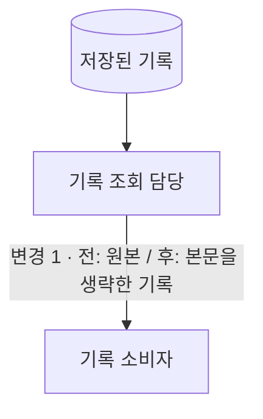

# 모든 diff의 작성 이유를 설명한다

목표는 사용자가 모든 diff 코드를 볼 때 왜 이렇게 작성했는지 이해하는 것이다.
대표 흐름은 읽기의 입구이며 설명 범위의 상한이 아니다. explain이 이 작성 규칙을 소유하고,
start·align·handoff·pr은 해당 시점의 코드·합의·diff와 출력 위치를 전달해 explain을 호출한다.
PR 게시나 그림 완성은 사용자의 코드 이해 확인을 대신하지 않는다.

## 해결 방법의 읽는 순서

1. **아이디어:** 구체적인 문제와 변경 원리. 무엇을 바꾸고 무엇을 유지하는지, 왜 그 경계에서
   해결하는지 설명한다. 작업 일지나 버린 접근 목록으로 시작하지 않는다.
2. **하이레벨 추상화:** 대표 입력·데이터 하나가 생성 → 처리 → 보관·소비되는 경로를 따른다.
   파일명 없이 인프라 경계, 처리 주체, 데이터 형태와 전후 동작을 설명한다.
3. **파일레벨 추상화:** 같은 경로·방향·용어를 유지하고 각 주체를 실제 파일·함수로 펼친다.
   이어서 `흐름에서의 역할 / 파일·함수 / 변경 전 → 후와 이유`를 매핑하고 읽는 순서를 안내한다.
4. **테스트:** 위 경계에서 변경되는 동작과 유지할 계약을 기대값으로 설명한다.
   실행 결과·실패·미측정 사항은 handoff의 결과에 기록하고, 테스트 통과로 성능 개선 등을 추정하지 않는다.

여러 모듈에 걸친 변경이나 인프라 경계를 바꾸는 작업은 두 단계 추상화를 사용한다.
한 파일의 국소 변경은 짧은 전후 설명·표로 충분하면 그림을 생략한다. 문서·정책 변경은
입력 문서 → 판단 주체 → 출력 문서를 따라 설명하며, 존재하지 않는 인프라를 만들지 않는다.

## 그림의 구분과 방향

| 종류 | 기본 표현 | 설명할 내용 |
|---|---|---|
| 인프라 | 바깥 테두리 | 실제 실행·보관 위치. 저장소 폴더와 실행 환경을 혼동하지 않는다. |
| 주체 | 사각형 | 작업을 수행하는 사람·프로그램·컴포넌트. 하위 그림에서 파일·함수로 연결한다. |
| 데이터 | 원통 | 저장되는 파일·레코드·문서. 이동 중인 데이터의 이름·형태는 화살표에 쓴다. |
| 로직·전달 | 설명이 붙은 화살표 | 무엇을 처리하고 어떤 데이터를 어디로 넘기는가. 복잡한 처리는 담당 주체 안에 설명한다. |

화살표는 데이터 이동 방향으로 통일한다. 호출·의존 관계가 필요하면 아래 설명에서 별도로
다루고 데이터 흐름에 섞지 않는다. 같은 파일이 서버에서 호출되고 원격 스크립트가 다른 환경에서
실행된다면 실행 위치별로 나눠 배치하고, 동일 파일에서 정의된 코드임을 표시한다.

## 각 단계의 한 그림에서 변경 전후를 비교한다

- 하이레벨과 파일레벨 각각 한 그림 안에 전후를 표시하는 것을 기본으로 한다. 같은 대표 경로의
  이름·방향·배치를 유지하며, 변하지 않는 주체·데이터·경로는 공유한다.
- 경로는 같고 처리나 데이터 형태만 바뀌면 해당 상자·화살표에 `전: … / 후: …`를 나란히 적는다.
  경로 자체가 바뀌면 같은 그림에서 분기해 `전 · 제거`, `후 · 추가`를 표시하고 공통 지점에서 합친다.
- 전후는 대안이지 동시에 실행되는 단계가 아니다. 범례와 `전 / 후 / 유지` 문구로 구분하고,
  색상만으로 의미를 전달하지 않는다. 기존 동작은 base 코드, 변경 후는 최종 diff로 확인한다.
- 하이레벨은 처리 위치·소유·데이터 형태의 변화를, 파일레벨은 그 변화에 대응하는
  책임·입출력·구현 방식의 변화를 드러낸다. 두 단계에 같은 변경 이름이나 번호를 쓴다.
- 그림 바로 아래에서 핵심 차이와 그 위치에서 바꾼 이유를 설명한다. 동작이 유지되는
  리팩토링이면 그 사실과 파일레벨의 책임 이동을 구분한다.
- 세로 흐름과 짧은 이름을 우선한다. 긴 경로는 아래 파일 매핑으로 옮긴다. 가지가 많으면
  대표 경로와 추가 경로를 나눠 설명한다. 모든 파일을 한 그림에 밀어 넣지 않는다.
  합친 그림이 교차선·중복으로 더 읽기 어려울 때만 같은 배치의 전후 그림으로 나눈다.

짧은 예: 같은 경로에서 데이터 형태만 달라지는 변경. 이 표기법을 각 추상화 단계에 적용한다.

## CE: 모든 변경을 설명에 연결한다

CE(Collectively Exhaustive)는 모든 diff가 설명에 빠짐없이 대응한다는 뜻이다. 전체 변경 파일과
각 변경 구간을 읽고, 어느 흐름·역할·작성 이유로 설명했는지 대조한다. 파일 이름을 표에 한 번
넣었다고 그 파일의 다른 함수·분기 변경까지 설명한 것으로 보지 않는다.

대표 경로의 진입점 → 처리 → 저장·응답 순서로 실제 코드 링크를 제공한다. 각 변경 단위에는
흐름에서의 역할, 기존 방식의 문제, 변경 전후의 동작·계약, 그 위치·이름·분기·구현 방식을
택한 이유를 필요한 만큼 연결한다. 단순히 코드를 한국어로 읽어 주는 것으로 이유를 대신하지 않는다.
확인된 요구·코드·합의로 이유를 뒷받침하고, 타인의 의도가 확인되지 않으면 추론임을 밝힌다.

공통 규칙·대체 구현·예외 처리뿐 아니라 삭제·이동·타입·설정·의존성·주석·테스트·생성 파일도
빠뜨리지 않는다. 관련 경로에 묶되 별도 이유가 있는 변경은 따로 설명한다. 같은 이유의 반복 변경은
대표 코드와 적용 대상·차이를 묶어 설명할 수 있다. 줄마다 주석을 달거나 별도 점검 장부를 만들라는
뜻은 아니다. 공통 함수를 별도 서비스처럼 그리거나 모든 파일을 그림에 밀어 넣지 않는다.

구현 전에는 예정된 변경 범위와 코드 초안에 적용하고, 구현 후에는 최종 diff 전체와 대조한다.
새 변경이 생기면 기존 설명을 갱신한다. 코드나 작성 이유를 확인할 수 없는 구간은 미확인으로 남기며,
CE 점검 완료를 독자의 이해 완료로 보고하지 않는다. 요청 범위 밖의 저장소 전체로 확대하지 않는다.

테스트는 파일 개수보다 흐름의 기대 동작에 대응시킨다. 예를 들어 데이터 제거 변경이라면
제거 대상, 보존 대상, 전송 경계, 기존 데이터 호환성, 우회 조회를 확인한다. 이 예를 모든 PR의
필수 검사로 일반화하지 않는다. 검증되지 않은 효과와 남은 이해 문제는 한계로 남긴다.
